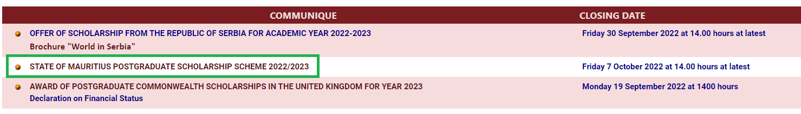
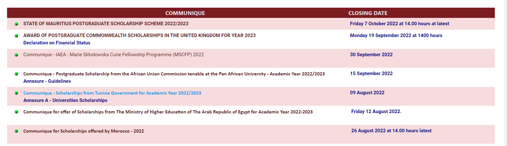

# 🔔 mauritius-scholarship-alert


Get notified by email each time the Ministry of Education of Mauritius posts a new scholarship communique on its [website](https://education.govmu.org/Pages/Downloads/Scholarships/Scholarships-for-Mauritius-Students.aspx).


# 🚀Features
- Receive an email notification at most 12 hours after a new scholarship is posted.
- Option to filter scholarships by type.
- Asynchronous programming to speed up fetching of PDFs on website.
- Receive an email reminder 3 days before the closing date of a scholarship.

# ⚙ How it works
- Github Actions is used to automatically run `main.py` script every day.
 - The program scrapes the scholarship website and checks for any new communique. 
 - Newly discovered communiques are sent by email to you. Your own email address will be used to send you emails.
 - The most recent commnique found is then saved in `scrape.json` for future reference.

 

# ✍Usage
## Run with Github Actions 
- The fastest way to get started is to fork this repository.
- [Create a gmail app password](https://itsupport.umd.edu/itsupport/?id=kb_article_view&sysparm_article=KB0015112&sys_kb_id=76433076dbdf8c904cb035623996194b&spa=1). Keep a copy of this password.
- Create 2 [Github repository secrets](https://docs.github.com/en/actions/security-guides/encrypted-secrets) with the names `EMAIL_PASSCODE` and `SENDER_EMAIL_ADDRESS`. `EMAIL_PASSCODE` should contain your newly created gmail app password and `SENDER_EMAIL_ADDRESS` should contain the corresponding gmail account. Do not include quotation marks.


> It is **NOT** recommended to use your gmail account password as the `EMAIL_PASSCODE` even though it works.

> The value `EMAIL_PASSCODE` should not be shared and must not be present in the code. 

## Run locally without Github Actions
- Clone repo.

```bash
git clone git@github.com:creme332/mauritius-scholarship-alert.git
```

- Install dependencies.
```
pip install -r requirements.txt
```

- Create a `.env` file with the following contents :
```bash
EMAIL_PASSCODE = "your gmail app password"
SENDER_EMAIL_ADDRESS = "your gmail email address"
```
- Execute `main.py` function.

## Filtering scholarships
By default filtering option is turned off. To turn on, enter keywords in `keywords.txt`. You will only be notified of scholarships matching **at least one of the keywords**.

For example, to be notified of only master's scholarships to the UK, your `keywords.txt` should look like this :
```
master's
uk
```
Keywords may include country name, degree level, ...

Keep `keywords.txt` empty to disable filtering.

## Filtering reminders of closing dates
By default you will not receive a reminder 3 days before the closing date of a scholarship. To turn on, enter the **exact name** of the communique/s in `scholarships.txt`. 

For example, suppose you want to be reminded of the scholarship highlighted below 3 days before its closing date. 



Your `scholarships.txt` should contain :
```
​STATE OF MAURITIUS POSTGRADUATE SCHOLARSHIP SCHEME 2022/2023
```
Keywords may include country name, degree level, ...

Keep `scholarships.txt` empty to disable reminders.

To be reminded of all scholarships, place only an asterisk `*` in the first line of `scholarships.txt`.

```
*
```

# 🤚 Limitations
- At most 2000 emails per day and 3000 recipients per day.
- If you set your repository to private, Github Actions will give you only 2000 execution minutes per month. A public repository has no such limit. (The `main.py` script takes less than 1 minute to execute on Github actions.) 

For updated information about quotas :
- [Github Actions Quotas](https://docs.github.com/en/billing/managing-billing-for-github-actions/about-billing-for-github-actions)
- [Gmail Quotas](https://support.google.com/a/answer/166852?hl=en)

# 🙋‍♂️Disclaimer
- This project is not affiliated with the Ministry of Education of Mauritius. 
- A major change to the HTML code of the website may cause the program to crash.

For reference purposes, here's how the website was structured at the time when my program was working properly :



# 📃License
 This project uses the MIT license.

# Issues faced when scraping
- Website has inconsistent HTML. (no standard date format for closing date, erratic line breaks, presence of LF/CR chars, ...)

# Safety checks

- At most 5 emails is sent every 12 hours to mitigate consequences if program malfunctions.

# 🔨 To-Do
- [ ] Remind me of approaching closing dates.
- [ ] Add unit tests + possibly a separate workflow
- [ ] Save all scraped data to Firestore
- [ ] Create a registration form so that anyone can subscribe for updates.

### ✔ Done
- [x] Option to filter scholarships by type
- [x] Add project social media preview.
- [x] Add automatic build passing/failed shield
- [x] Create new github secret for email
- [x] Try to reduce execution time : remove unused libraries, caching, optimise program, asyncio ...
- [x] Deal with case where lastscrapedcommunique is empty
- [x] Delete virtual env from github
- [x] Add requirements.txt file
- [x] Use Github Actions to automate scraping. [Read this](https://yasoob.me/posts/github-actions-web-scraper-schedule-tutorial/).