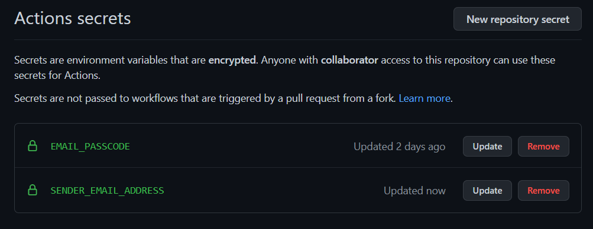

# 🔔 mauritius-scholarship-alert


Get notified by email each time the Ministry of Education of Mauritius posts a new scholarship communique on its [website](https://education.govmu.org/Pages/Downloads/Scholarships/Scholarships-for-Mauritius-Students.aspx).


# 🚀Features
- Receive an email notification at most 1 day after a new scholarship is posted.
<!-- - Receive a reminder a couple of days before the closing date of all scholarships.
- Option to filter scholarships by type. -->
- Asynchronous programming to speed up fetching of PDFs on website.

# 🙋‍♂️Disclaimer
- This project is not affiliated with the Ministry of Education of Mauritius. 
- A major change to the HTML code of the website may cause the program to malfunction.

# ⚙ How it works
- Github Actions is used to automatically run `main.py` script every day.
 - The program scrapes the scholarship website and checks for any new communique. 
 - The most recent commnique found is then saved in `scrape.json` for future reference.
 

# 🤷‍♂️Why not use the website directly ?
- No scholarship filtering options available.
- You will have to manually check the website for updates.
- Website has inconsistent HTML. (erratic line breaks, LF/CR chars, ...)

# ✍Usage
## Run with Github Actions 
- The fastest way to get started is to fork this repository.
- [Create a gmail app password](https://itsupport.umd.edu/itsupport/?id=kb_article_view&sysparm_article=KB0015112&sys_kb_id=76433076dbdf8c904cb035623996194b&spa=1). Keep a copy of this password.
- Create 2 [Github repository secrets](https://docs.github.com/en/actions/security-guides/encrypted-secrets) with the names `EMAIL_PASSCODE` and `SENDER_EMAIL_ADDRESS`. `EMAIL_PASSCODE` should contain your newly created gmail app password and `SENDER_EMAIL_ADDRESS` should contain the corresponding gmail account. Do not include quotation marks.



> It is **NOT** recommended to use your gmail account password as the `EMAIL_PASSCODE` even though it works.

> The value `EMAIL_PASSCODE` should not be shared and must not be present in the code. 

## Run locally without Github Actions
- Clone repo.

```
git clone git@github.com:creme332/mauritius-scholarship-alert.git
```

- Install dependencies.
```
pip install -r requirements.txt
```

- Create a `.env` file with the following contents :
```
EMAIL_PASSCODE = "your gmail app password"
SENDER_EMAIL_ADDRESS = "your gmail email address"
```

- Execute `main.py` function.


If you want to receive the current list of all communique on the site, set the contents of `scrape.json` to `{}` and run `main.py`. Please note that you will receive 50+ emails at once.

# 🤚 Limitations
- At most 2000 emails per day and 3000 recipients per day.
- If you set your repository to private, Github Actions will give you only 2000 execution minutes per month. A public repository has no such limit. (The `main.py` script takes less than 1 minute to execute on Github actions.) 

For updated information about quotas :
- [Github Actions Quotas](https://docs.github.com/en/billing/managing-billing-for-github-actions/about-billing-for-github-actions)
- [Gmail Quotas](https://support.google.com/a/answer/166852?hl=en)

# 📃License
 This project uses the MIT license.

# 🔨 To-Do
- [ ] be more stringent when comparing communique
- [ ] Add unit tests
- [ ] Improve email template
- [ ] Save all scraped data to Firestore
- [ ] Create a registration form so that anyone can subscribe for updates.

### ✔ Done
- [x] Add project social media preview.
- [x] Add automatic build passing/failed shield
-[x]Create new github secret for email
- [x] Try to reduce execution time : remove unused libraries, caching, optimise program, asyncio ...
- [x] deal with case where lastscrapedcommunique is empty
- [x] Delete virtual env from github
- [x] Add above assumption to code
- [x] Add requirements.txt file
- [x] Use Github Actions to automate scraping. [Read this](https://yasoob.me/posts/github-actions-web-scraper-schedule-tutorial/).