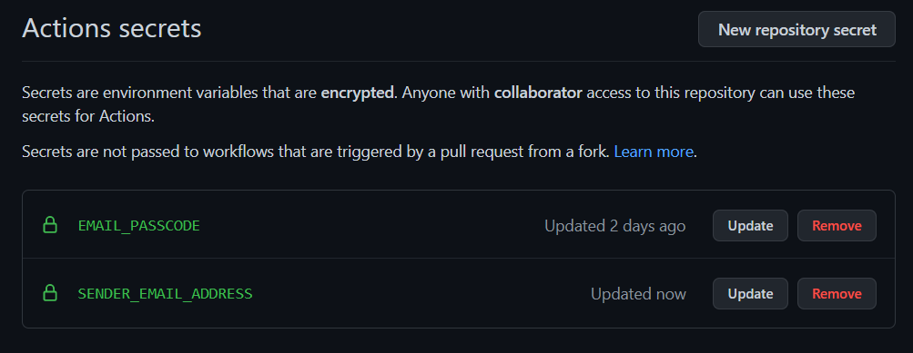

# Installation Guide
- [Installation Guide](#installation-guide)
  - [Using Github Actions](#using-github-actions)
    - [Prerequisites](#prerequisites)
    - [Instructions](#instructions)
  - [Using RSS/Atom reader](#using-rssatom-reader)
    - [Prerequisites](#prerequisites-1)
    - [Instructions](#instructions-1)
  - [For local development](#for-local-development)
    - [Prerequisites](#prerequisites-2)
    - [Instructions](#instructions-2)
  - [Testing](#testing)

## Using Github Actions
Follow the instructions in this section if you only want to use the tool without installing the project locally. 

### Prerequisites
- A Github account
- A Gmail account

### Instructions
1. Fork the repository.
1. Enable two-factor authentication on your Gmail account if not already enabled.
2. Create an [App Password](https://itsupport.umd.edu/itsupport/?id=kb_article_view&sysparm_article=KB0015112&sys_kb_id=76433076dbdf8c904cb035623996194b&spa=1) for your account. Keep a copy of this password.
3. In your repository settings, create two [Github repository secrets](https://docs.github.com/en/actions/security-guides/encrypted-secrets) named  `EMAIL_PASSCODE` and `SENDER_EMAIL_ADDRESS` respectively. `EMAIL_PASSCODE` should contain your newly created gmail app password and `SENDER_EMAIL_ADDRESS` should contain the corresponding gmail account. Do not include quotation marks in text box provided by Github.
    
4. Everything is now setup and the scraper will run automatically through Github Actions.
> 🔴 **Note**: Never use your gmail account password as the `EMAIL_PASSCODE` even though it works. The value `EMAIL_PASSCODE` must not be shared with anyone and must not be present in the code.

## Using RSS/Atom reader
Use this method if you only want to be notified of new communiques. This method
does not support advanced features such as filtering options and deadline reminders.

### Prerequisites
- A RSS/Atom feed reader (examples: [Mozilla Thunderbird](https://blog.thunderbird.net/2022/05/thunderbird-rss-feeds-guide-favorite-content-to-the-inbox/), [FeedBro](https://chromewebstore.google.com/detail/feedbro/mefgmmbdailogpfhfblcnnjfmnpnmdfa) browser extension, ...)
### Instructions
Add the following URL to your feed reader:
```
https://creme332.github.io/mauritius-scholarship-alert/feed.xml
```
## For local development
### Prerequisites
- Python 3.9
- Git
- A Gmail account

### Instructions
Clone the repository:
  ```bash
  git clone git@github.com:creme332/mauritius-scholarship-alert.git
  ```

Move to the root directory of the project:
 ```bash
 cd mauritius-scholarship-alert
 ```

Create a virtual environment using a method of your choice and activate it. For example:
```bash
python -m venv .venv
source .venv/bin/activate
```

Install the required dependencies in your virtual environment:
 ```
 pip install -r requirements.txt
 ```
Create a `.env` file in the root directory the project:
 ```bash
 EMAIL_PASSCODE = "your gmail app password"
 SENDER_EMAIL_ADDRESS = "your gmail email address"
 ```
Run `src/main.py` script:
```bash
python src/main.py
```

## Testing
Inside the root directory of the project, run:
```
pytest
```