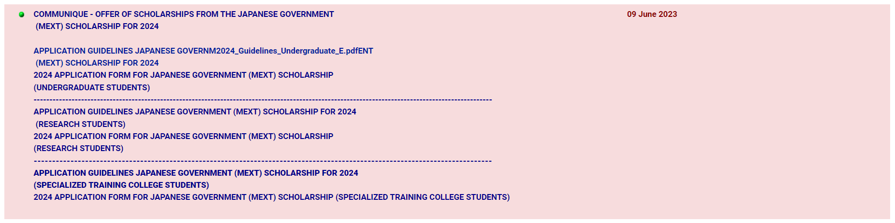
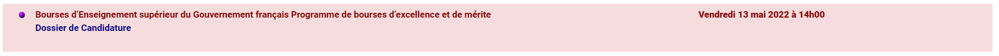

# Scraping notes

The scholarship website can be simplified to a table in the following format:
```
.---------------------------------.------------------------------------.
|           COMMUNIQUE            |              DEADLINE              |
:---------------------------------+------------------------------------:
| COMMUNIQUE 1                    |                                    |
:---------------------------------+------------------------------------:
| COMMUNIQUE 2                    | Friday 01 December 2023 at latest  |
:---------------------------------+------------------------------------:
| COMMUNIQUE 3 + Application Form | 30 June 2023                       |
'---------------------------------'------------------------------------'
```

## Key notes
1. Deadlines are not always specified.
1. The deadline has no consistent formatting.
2. Empty rows may be present.
3. Some rows may contain multiple lines with links:
    
4. The language used can be french:
    
5. Links in each row are URLs of PDF files.
6. A PDF file inside a link can contain an image instead of text that can be parsed.
1. Communiques listed on the website are ordered chronologically by deadline (the newest communiques appear on top).